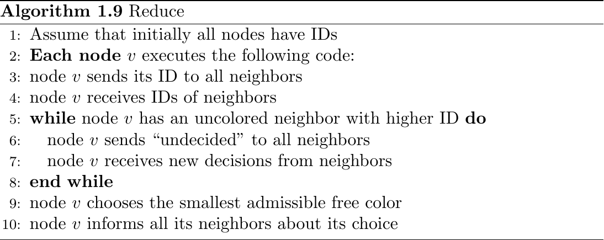
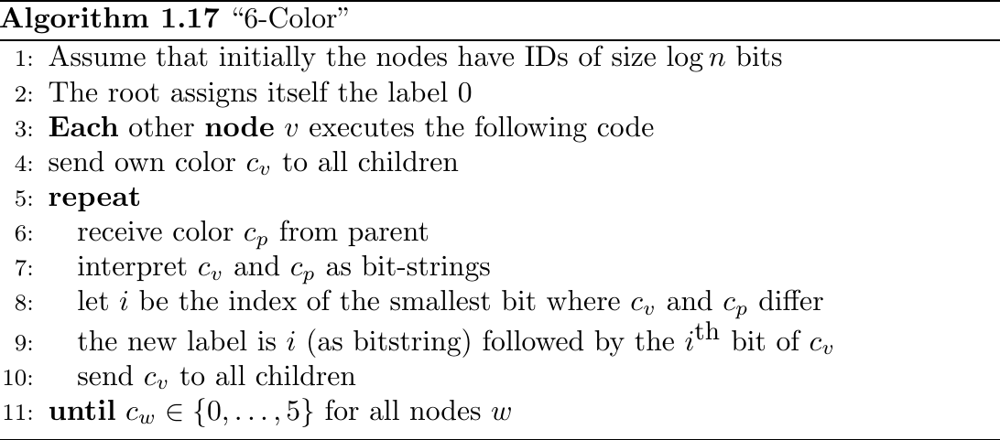
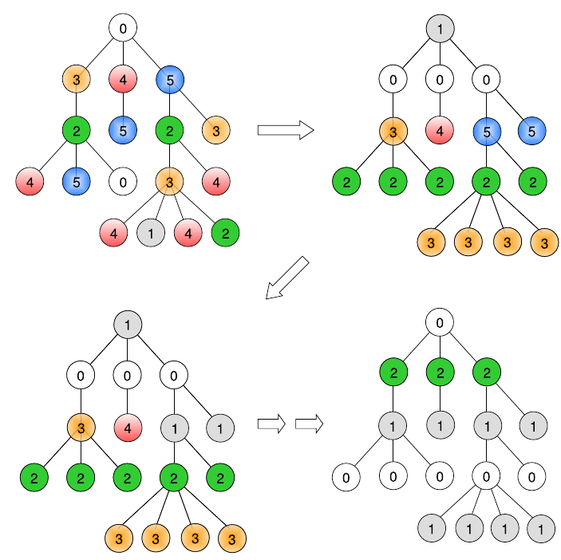

# Vertex Colouring \dotfill 5

## Problem \& Model \dotfill 5
Problem Statement: For undirected graphs $G=(V, E)$ assign colour $c_v$ to each vertex $v \in V$ such that $e = (v, w) \in E \implies c_v \not = c_w$.

Goal: Use as few colours as possible.

Assumption: Nodes (== vertex) have unique identifiers (of size $\log(n)$).

Definition (Chromatic Number): Given a undirected $G$, the chromatic number $\chi(G)$ is minimum number of colours to solve Problem Statement.

Definition (Degree): Number of directly connected neighbours of a vertex $v$ denoted by $\delta(c)$ is the degree of $v$. The maximum degree vertex in a graph $G$ defines the graph degree $\Delta(G)$.

Note: Sometimes $\chi(G) \ll \Delta(G)$.

### Greedy Sequential \dotfill 6
{ width=75% }

Time Complexity: $O(n)$ for $\Delta+1$ colours.

### Reduce \dotfill 7
{ width=75% }

Time Complexity: $O(n)$ for $\Delta+1$ colours.

## Coloring Trees \dotfill 8
Lemma (Colouring Trees): $\chi(G_{Tree}) \leq 2$.

### Slow Tree Colouring \dotfill 8
{ width=75% }

Time Complexity: Height of tree. For balanced binary trees have $O(\log(n))$, degenerate tree (i.e. list) have $O(n)$.

### 6-Colour \dotfill 9
{ width=75% }

Time Complexity: $O(\log^*(n))$.

### Shift Down \dotfill 10
{ width=75% }

Lemma (Shift Down): Preserves colouring legality and makes siblings monochromatic (same colour).

### Six-2-Three \dotfill 10
{ width=75% }

Lemma: Algorithm "6-colour" and "Six-2-Three" colour a tree in $O(\log^*(n))$ time.

Example Execution:

{ width=75% }

Note: This can be generalized to any general graph with constant $\Delta$ to be coloured using $\Delta+1$ colours in $O(\log^*(n))$ time. The idea is as follows: In each step, a node compares its label to each of its neighbors, constructing a logarithmic difference-tag as in Algorithm 1.17. Then the new label is the concatenation of all the difference-tags. For constant degree $\Delta$, this gives a $3\Delta$-bit label in $O(\log^*(n))$ steps. Algorithm 1.9 then reduces the number of colors to $\Delta+1$ in $2^{3\Delta}$ (this is still a constant for constant $\Delta!$) steps.
